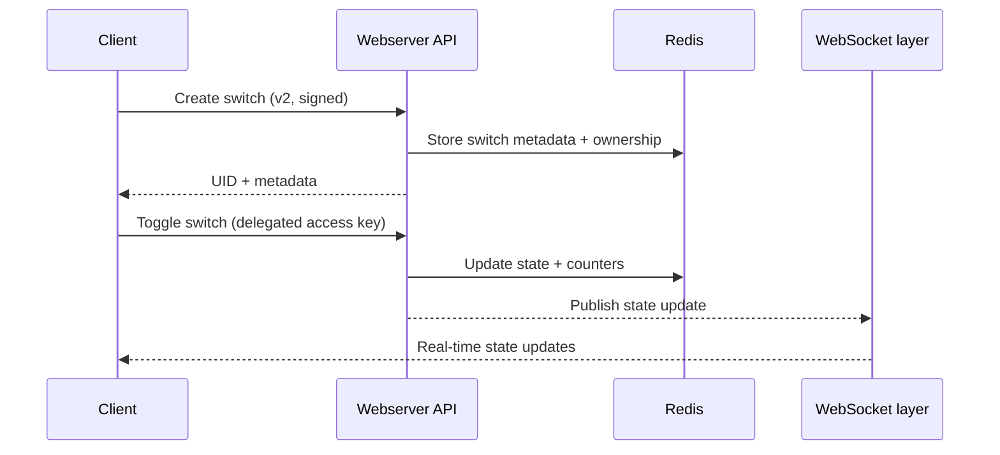
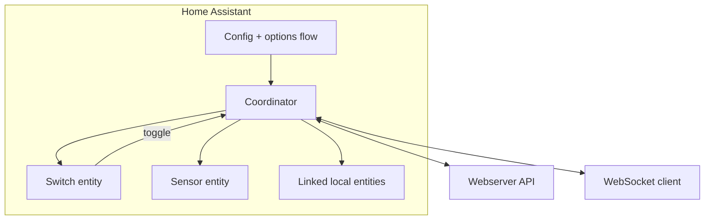
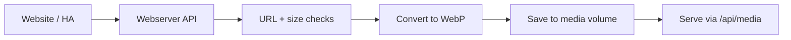

# Architecture Diagrams (Public-Safe)

Server / website / API for [sync.vome.io](https://sync.vome.io). The Home Assistant
integration lives in [Vortitron/VomeSync](https://github.com/Vortitron/VomeSync).

## Detailed architecture docs

- `docs/ARCHITECTURE_SERVER.md` — deployment + server internals
- `docs/API.md` — API endpoints + flows
- `docs/ARCHITECTURE_INTEGRATION.md` — Home Assistant integration + menu map
- `docs/ARCHITECTURE_WEBSITE.md` — website UI + data flows

## 1) Deployment Topology (Server + Backend Apps)

```mermaid
flowchart LR
	Browser[Web browser]
	HA[Home Assistant]

	subgraph Edge["Public edge"]
		Proxy[Nginx reverse proxy]
	end

	subgraph Server["VomeSync server"]
		Website[Website (static assets)]
		API[Webserver API + WebSocket]
		Redis[(Redis)]
		Media[(Media volume)]
	end

	Browser -- HTTPS --> Proxy
	HA -- HTTPS / WSS --> Proxy
	Proxy --> Website
	Proxy --> API
	API --> Redis
	API --> Media
```

## 2) API Flow (High‑Level)



## 3) Home Assistant Integration (Components)



## 4) Integration Menu Map (Options Flow)

```mermaid
flowchart TD
	Init[Options menu]
	More[More...]
	Manage[Manage switches]
	ActionMenu[Switch actions]

	Init --> Create[Create switch]
	Init --> Subscribe[Subscribe to switch]
	Init --> Manage
	Init --> More

	Manage --> ActionMenu
	ActionMenu --> View[View details]
	ActionMenu --> Edit[Edit settings (owners)]
	ActionMenu --> Keys[Access keys (owners, v2)]
	ActionMenu --> Website[Manage on website (owners, v2)]
	ActionMenu --> Link[Link local entities]
	ActionMenu --> Delete[Delete switch (owners)]
	ActionMenu --> Remove[Remove from this installation]

	More --> Backup[Backup signing key]
	More --> Import[Import switches]
	More --> Reannounce[Re‑announce owned switches]
	More --> Cleanup[Clean up orphaned devices]
	More --> EditURLs[Edit connection URLs]
	More --> Back[Back]
	Back --> Init
```

## 5) Media Ingestion (Icons / Banners)



## 6) Key Handling (Public‑Safe View)

```mermaid
flowchart LR
	Client --> API[Webserver API]
	API --> Hash[Derive hashed key IDs]
	Hash --> Redis[(Redis)]
	API --> Log[Logger (redaction)]
```

