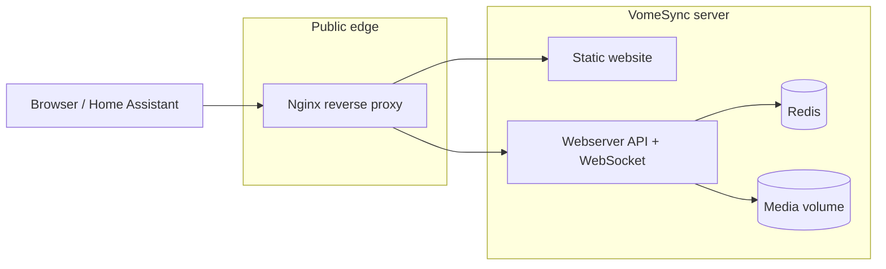
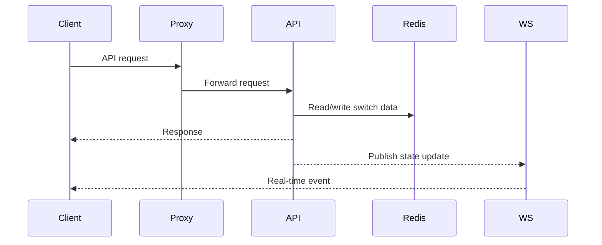
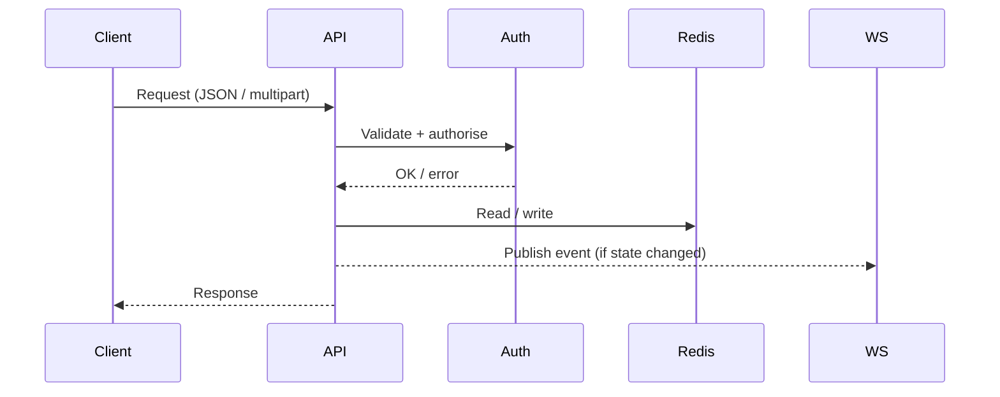
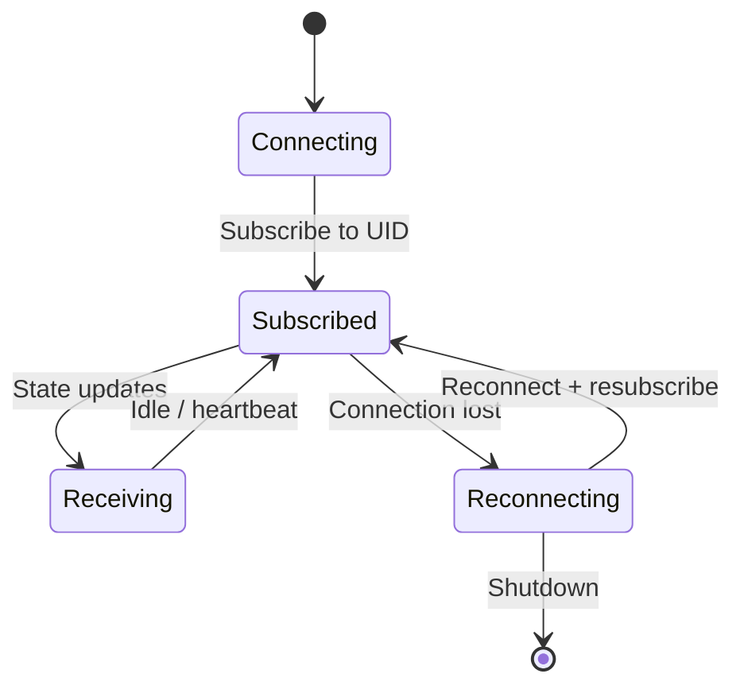
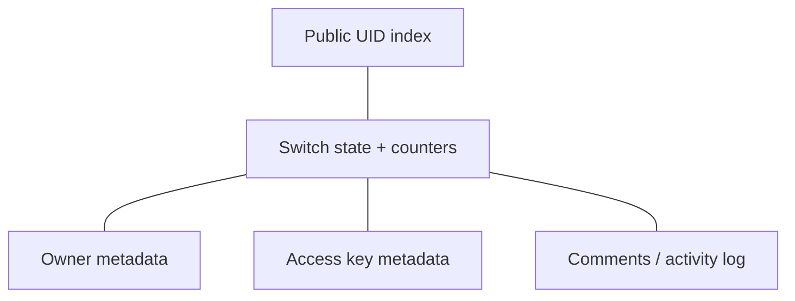
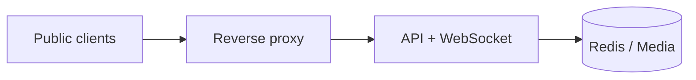
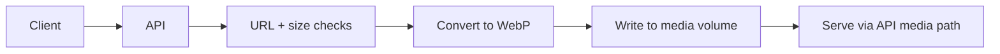

# Server Architecture (Public‑Safe)

This document describes the **server‑side deployment and runtime architecture** at a high level. It intentionally omits sensitive details (internal hostnames, ports, secrets, and provider‑specific metadata).

## 1) System Context



## 2) Component Responsibilities

- **Reverse proxy**: TLS termination, routing to Website or API/WebSocket.
- **Website**: Static HTML/CSS/JS directory UI.
- **Webserver API**: REST + WebSocket endpoints, auth/permissions, metadata handling.
- **Redis**: Switch state, counters, and key‑metadata lookup (hashed IDs).
- **Media volume**: Stored WebP icons/banners served via the API.

## 2.1) Webserver Module Map (Public‑Safe)

```mermaid
flowchart LR
	Request[HTTP request]
	CORS[CORS / headers]
	Rate[Rate limit]
	Validate[Schema validation]
	Auth[Auth / permissions]
	Handler[Route handler]
	Redis[(Redis)]
	Media[(Media)]
	WS[WebSocket broadcaster]
	Log[Logger (redaction)]

	Request --> CORS --> Rate --> Validate --> Auth --> Handler
	Handler --> Redis
	Handler --> Media
	Handler --> WS
	Handler --> Log
```

## 3) Request and Update Flow



## 3.1) Routing Summary (Public‑Safe)

- **Website**: public static pages for browsing and switch detail views.
- **API**: JSON + multipart endpoints for switch lifecycle and metadata.
- **WebSocket**: per‑switch subscriptions for real‑time updates.
- **Media**: WebP assets served from the API origin.

## 3.2) Request Pipeline (Public‑Safe)



## 4) WebSocket Lifecycle (High‑Level)



## 4.1) WebSocket Endpoints and Upgrade Routing

The webserver exposes two WebSocket endpoints on the WS port:

- `/ws` — the public, UID‑keyed switch socket (`src/websocket/manager.js`).
- `/ws/relay` — the authenticated relay control channel for users' own Home
	Assistants (`src/websocket/relayManager.js`); the component dials out and
	presents a per‑instance secret which is verified against the portal.

Both run in `noServer` mode behind a single upgrade router
(`src/websocket/upgradeRouter.js`) that dispatches by exact pathname.
**Do not attach multiple `WebSocket.Server({ server, path })` instances to one
HTTP server**: in ws 8.x each registers its own `upgrade` listener and aborts
handshakes for paths it doesn't own with a 400 — that bug rejected every
`/ws/relay` handshake in production. New WS endpoints must be added as
`noServer` servers routed through the upgrade router (unknown paths get 404).

The relay also has portal-only internal HTTP endpoints (`/internal/relay/*`,
bearer `RELAY_INTERNAL_SECRET`, never exposed by nginx): `dispatch` (broker an
HA call down a socket), `status` (which `server_id`s are connected — powers the
Connected/Offline pills on vome.io), and `disconnect` (force-close a socket
when its link is deleted or its secret rotated; secrets are only verified at
connect time, so revocation must also drop the live socket).

## 5) Data Persistence (Public‑Safe)

High‑level data groups stored in Redis:
- **Switch state**: current state, timestamps, counters.
- **Ownership metadata**: v2 owner identifiers and switch public key references.
- **Access keys**: delegated key metadata (stored by hashed IDs).
- **Public index**: list of public UIDs for discovery.



## 6) Trust Boundaries (Public‑Safe)



## 7) Media Ingestion (Icons / Banners)



## 8) Operational Considerations (Public‑Safe)

- The server is designed to be stateless aside from Redis + media volume.
- Redis and media persistence should be backed up regularly.
- WebSocket fans out to all subscribed clients for real‑time state updates.

