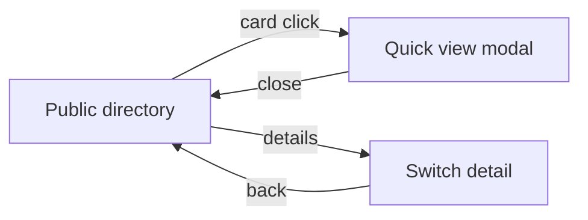
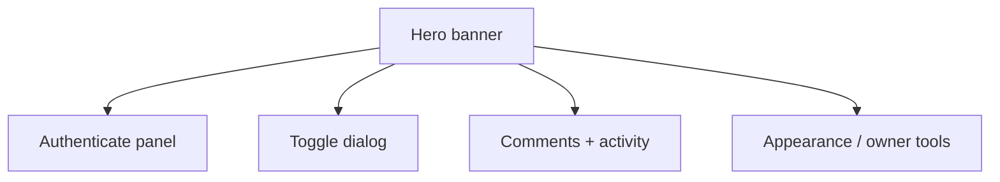
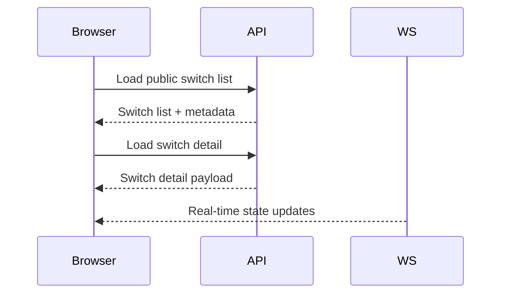
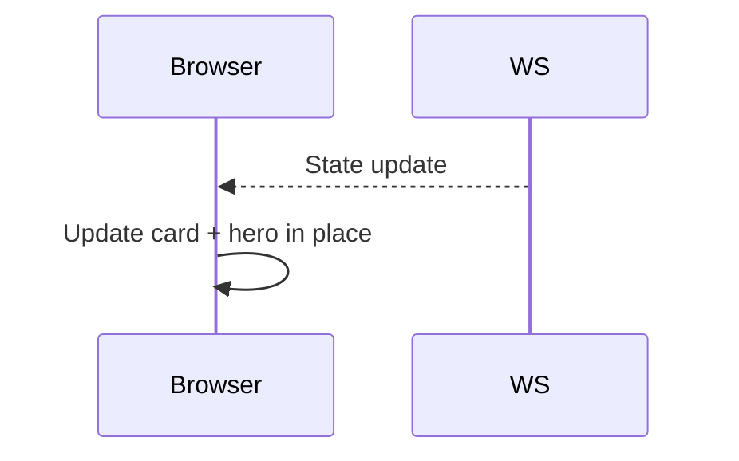
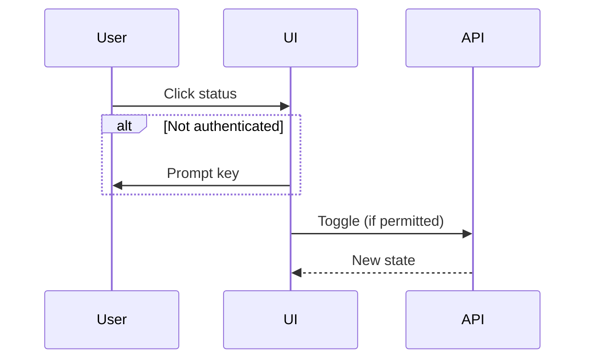
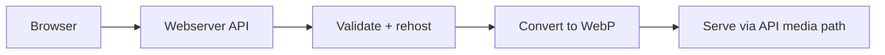
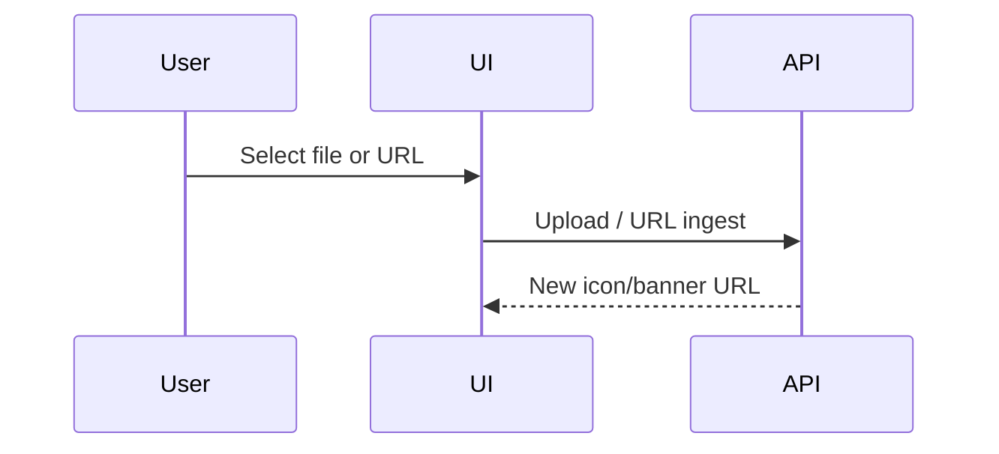
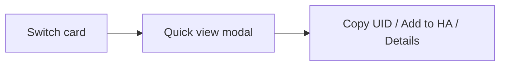

# Website Architecture (Public‑Safe)

This document outlines the **public website** behaviour and data flow. It intentionally avoids sensitive details.

## 1) Page States



## 1.1) UI Component Map (Detail Page)



## 2) Data Flow (Directory + Switch Detail)



## 2.1) Update Strategy

- Initial directory load uses a single API call for public switches.
- Incremental updates are applied in place to avoid flicker.
- WebSocket messages update visible switches in real time.

## 2.2) Real‑Time Update Flow



## 3) Authentication (Per‑Switch)

```mermaid
flowchart TD
	KeyInput[Authenticate (enter key)]
	Validate[Validate permissions]
	ReadOnly[Read‑only]
	Write[Toggle / Comment / Manage]

	KeyInput --> Validate
	Validate --> ReadOnly
	Validate --> Write
```

Notes:
- Authentication applies **per switch** rather than a global account.
- Keys are stored in browser session storage and can be forgotten at any time.
- Optional “Stay logged in” uses local storage and expires server‑side (max 30 days).

## 3.1) Actions Gated by Auth

- **Read‑only**: view public switch details and activity.
- **Write**: toggle, comment, and appearance updates (if permitted).

## 3.2) Toggle Flow (Public‑Safe)



## 4) Media Flow (Icons / Banners)



## 4.1) Appearance Update Flow



## 5) Quick View Modal



## 6) Deep‑Link and Share Flows

- Switch detail URLs are shareable.
- Manage‑on‑website deep links are time‑limited and regenerate when needed.

